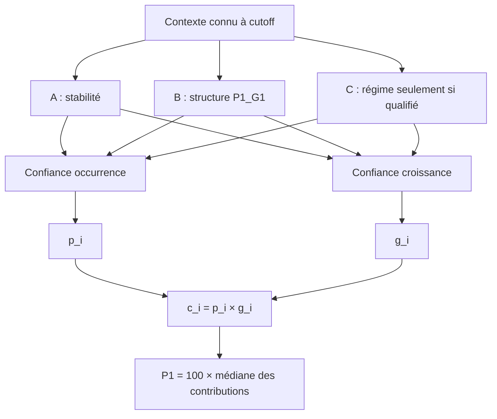

# Orchestration contextuelle des experts — protocole avant scoring

## Experts et sélection indépendante des scores

**A = stabilité** : occurrence globale et médiane de croissance du champion inchangées. Ancre obligatoire et repli permanent.

**B = structure**, exactement `P1_G1` : occurrence global → province → province/mois ; croissance global → province. Aucun niveau bâtiment ajouté, aucun retour à D. Les supports mesurent les observations du dernier niveau effectivement utilisé ; ils ne sont pas des tailles d'échantillon indépendantes démontrées. Les unités réapparaissant dans l'historique peuvent être corrélées.

**C_occurrence = NONE et C_growth = NONE sur les trois cutoffs audités.** Le candidat unique de chaque composante est défini pour une application future sans changement de règle : dernière cohorte historique **calendaire Y−1**, taux moyen des labels O qualifiés pour l'occurrence ; médiane G des unités/années positives qualifiées pour la croissance. Une croissance négative reste valide. Minimum **30** observations de la composante et couverture des labels de la dernière cohorte **≥80 %**, tous qualifiés selon les règles de maturité de A. Sans qualification : C absent, confiance nulle, repli A/B.

À cutoff, les dernières cohortes ont 10/350, 8/405 et 13/645 labels connus, et seulement 5/4/2 positifs. Leurs sous-échantillons sont trop petits et sélectionnés par maturité. La sélection ne dépend d'aucun P1 réalisé. Les autres signaux sont audités comme contexte ou rejetés pour disponibilité, pas comparés sur une grille de scores. Fenêtre calendaire choisie pour correspondre au contrat annuel, sans recherche de lookback. Les renouvellements/relocations historiques mûrs peuvent être décrits, mais leur type futur n'est jamais attribué à une candidate.

Momentum d'effectif courant, gap, concessions et asking : qualification source existante conservée, pas de nouvelle feature. Externe : **REJECT_EXTERNAL_FOR_C**, aucun signal admissible et utile aux trois origines. Aucune nouvelle collecte ou reconstruction de concessions.

## Formules de confiance figées avant backtests

Constantes : ancre A = **1**, échelle de support **k=30**, minimum récent **30**, couverture minimum **0,80**. Le support 30 reprend la convention prudente de la fondation et évite de faire confiance à quelques observations ; 80 % impose que la grande majorité de la cohorte historique soit qualifiée plutôt qu'une poignée de baux courts. Ces choix sont structurels, **pas des seuils validés statistiquement ou optimisés sur trois erreurs**.

Chaque composante possède ses poids propres. Pour une candidate i :

- `q_B = n_B/(n_B+30)` si B possède un niveau spécialisé effectivement appris ; sinon 0. Un repli **entièrement global** vaut 0, même si le global B diffère de A par sa population de train. Un repli enfant → province utilise le support du parent réellement appris.
- `d_B = min(|B−A|, |B−global_B|)` : le support élevé ne suffit pas si la structure n'apporte aucune différence au global et à A.
- Échelle d'occurrence `S_p=max(sqrt(p_A*(1−p_A)), 1/(n_A+1))` ; échelle de croissance `S_g=max(IQR(G_A), |g_A|, epsilon_machine)`. Elles décrivent la dispersion/échelle historique, **pas des erreurs standards ni des intervalles de confiance**.
- `t_A=1` ; `t_B=q_B*d_B/(d_B+S)`.
- C exige la qualification ci-dessus, une estimation finie et une dispersion récente finie. `q_C=n_C/(n_C+30)` ; `coherence=S/(S+dispersion_C)` ; `d_C=|C−A|`.
- `t_C=qualification_C*q_C*coverage_C*coherence*d_C/(d_C+S)`. Dispersion occurrence récente : `sqrt(p_C*(1−p_C))` ; dispersion croissance : IQR des G récents qualifiés. C non qualifié/absent donne exactement 0, jamais une valeur inventée.
- `w_E=t_E/(t_A+t_B+t_C)` pour E=A/B/C, séparément pour p et g. Poids non négatifs, somme 1 ; A ≥1/3 avec ces scores bornés. L'absence de spécialistes conduit à A avec poids 1.

`p_i=Σ_E w_Ep*p_Ei`, `g_i=Σ_E w_Eg*g_Ei`, `c_i=p_i*g_i`, `P1=100*médiane(c_i)`. Les poids sont unitaires pour B, car province/mois et support peuvent varier par candidate. C éventuel est **portefeuille**, sans granularité artificielle. C indisponible est remplacé en mémoire par A avant multiplication, avec poids nul, pour éviter `0*NaN`.

Le HHI bâtiment, le HHI des échéances et la concentration des termes 12 mois sont rapportés comme contexte. Ils ne fabriquent aucune probabilité de rupture ; B ne segmente pas les bâtiments. Les parts de support/repli de la cohorte rendent visible la pertinence de sa hiérarchie sans coefficient HHI arbitraire.

## Freeze et contrat temporel

Audit à cutoff → choix de C → règles ci-dessus → dataclass immutable `RULES` → empreinte SHA-256 des règles, configurations B et implémentation → fixation des trois vecteurs d'experts/poids → **ensuite seulement** révélation des labels et scoring. L'empreinte est obligatoire à l'appel et vérifiée après scoring. Aucun seuil, constante, fenêtre ou poids ne sera modifié en fonction des résultats.

Clé `(sPropCode,sUnitCode)`, origines au 31 décembre Y−1, mêmes cohortes P1 que A. Features historiques à leurs propres origines, labels positifs mûrs selon début/signature/fin des deux baux ; labels en attente non imputés. Aucun `sRenewal` futur ni effectif/concession futurs dans le trust. La liste du contexte autorisé est fermée et refuse les cibles réalisées.

La qualification **SAFE_WITH_CONDITIONS** reprend la fondation : aucune archive CRM ne prouve la version historique parfaite. La disponibilité strictement archivée reste inconnue ; les tests empêchent les lignes futures, sans lever cette réserve de source. L'hypothèse de régime fait suite aux erreurs déjà connues : **ces trois années ne sont pas un holdout indépendant**, même sans optimisation des constantes.

Ce protocole est figé avant le premier scoring orchestré. Aucun forecast 2026 ne sera produit ; la fonction de prédiction est compatible avec cette origine pour une phase ultérieure, et n'est pas appelée sur cette année ici.

Empreinte du freeze avant scoring orchestré : `f8ce4bd1355a1ab3ee238bdbbb8754e38a70d332b72f5548c1187952dc51fa07`. Aucun résultat orchestré n’a été calculé avant cet enregistrement.

## Architecture

## Audit point-in-time de C

Une seule définition candidate par composante ; aucune comparaison de scores pour choisir un signal. Les taux récents ci-dessous décrivent le sous-échantillon **qualifié**, pas la cohorte entière : leur sélection de maturité empêche de les extrapoler. Une médiane sous cinq positifs est masquée.

| year | component | support | coverage | estimate_pct | status |
| --- | --- | --- | --- | --- | --- |
| 2023 | growth | 5,000000 | 0,028571 | 1,130435 | NONE |
| 2023 | occurrence | 10,000000 | 0,028571 | 50,000000 | NONE |
| 2024 | growth | 4,000000 | 0,019753 | — | NONE |
| 2024 | occurrence | 8,000000 | 0,019753 | 50,000000 | NONE |
| 2025 | growth | 2,000000 | 0,020155 | — | NONE |
| 2025 | occurrence | 13,000000 | 0,020155 | 15,384615 | NONE |

Les fenêtres de trois cohortes ont une couverture des labels de **65,316 / 63,333 / 54,214 %**, malgré des supports plus élevés ; elles ne qualifient pas une dynamique récente représentative. Les transitions mûres de Y−1, les divergences, les statuts historiques renouvellement/relocation et les contextes de termes/échéance sont audités dans le notebook. Aucun deuxième signal C n'est testé sur les P1 réalisés.

Chaque ligne d'audit précise définition, disponibilité conditionnelle, support, couverture de maturité, estimation/missingness et raison de sélection/rejet. Les risques communs : fidélité CRM inconnue, censure par maturité, répétition d'unités, type futur inconnu. L'externe est filtré par le helper existant, sans nouvelle collecte. Tous les signaux non qualifiés restent hors prédiction.

## Résultats après freeze

| year | cohort_size | predicted_P1_pct | realized_P1_pct | error_pp | absolute_error_pp |
| --- | --- | --- | --- | --- | --- |
| 2023 | 405 | 2,872357 | 2,036102 | 0,836255 | 0,836255 |
| 2024 | 645 | 3,271845 | 1,607852 | 1,663993 | 1,663993 |
| 2025 | 856 | 2,972696 | 3,300878 | -0,328182 | 0,328182 |

### Occurrence : experts, poids moyens et calibration

| year | A_occurrence_pct | B_occurrence_pct | C_occurrence_pct | weight_A_p | weight_B_p | weight_C_p | final_occurrence_pct | realized_transition_pct | occurrence_error_pp | Brier |
| --- | --- | --- | --- | --- | --- | --- | --- | --- | --- | --- |
| 2023 | 98,327759 | 98,553810 | — | 0,922900 | 0,077100 | 0,000000 | 98,197622 | 99,012346 | -0,814723 | 0,009294 |
| 2024 | 98,475120 | 98,477597 | — | 0,926452 | 0,073548 | 0,000000 | 98,309977 | 98,294574 | 0,015403 | 0,016215 |
| 2025 | 98,189499 | 97,814598 | — | 0,914173 | 0,085827 | 0,000000 | 97,881110 | 90,303738 | 7,577372 | 0,092567 |

### Croissance : experts, poids moyens et erreur conditionnelle

| year | A_growth_pct | B_growth_pct | C_growth_pct | weight_A_g | weight_B_g | weight_C_g | final_growth_pct | realized_conditional_growth_pct | growth_median_error_pp | growth_MAE_pp |
| --- | --- | --- | --- | --- | --- | --- | --- | --- | --- | --- |
| 2023 | 2,918870 | 2,881567 | — | 0,997551 | 0,002449 | 0,000000 | 2,918779 | 2,085372 | 0,833407 | 3,845122 |
| 2024 | 3,319802 | 3,244485 | — | 0,998313 | 0,001687 | 0,000000 | 3,319653 | 1,699619 | 1,620033 | 4,690194 |
| 2025 | 3,024079 | 2,931619 | — | 0,997438 | 0,002562 | 0,000000 | 3,023803 | 3,716980 | -0,693176 | 4,280048 |

Les taux sont des moyennes sur toute la cohorte ; les médianes de croissance conditionnelle utilisent les mêmes unités positives pour comparer à G réalisé. **Seul le masque de scoring utilise ces positifs**, après fixation des prédictions. Les poids moyens ne reproduisent pas un mélange des moyennes : les poids varient par unité, sans aucune pondération fondée sur son résultat. Une moyenne finale peut donc sortir de l'intervalle des deux moyennes d'experts tout en restant une combinaison convexe **pour chaque unité**.

### Supports, replis, concentration et activation

| year | building_HHI | expiry_HHI | term12_share | hierarchical_child_support_share_p | B_global_fallback_share_p | B_global_fallback_share_g | B_support_share_p | B_support_share_g | activation_A_p | activation_B_p | activation_C_p | activation_A_g | activation_B_g | activation_C_g | A_dominance_p | A_dominance_g |
| --- | --- | --- | --- | --- | --- | --- | --- | --- | --- | --- | --- | --- | --- | --- | --- | --- |
| 2023 | 0,391715 | 0,096723 | 0,953086 | 1,000000 | 0,000000 | 0,000000 | 1,000000 | 1,000000 | 1,000000 | 1,000000 | 0,000000 | 1,000000 | 1,000000 | 0,000000 | 1,000000 | 1,000000 |
| 2024 | 0,225753 | 0,095593 | 0,959690 | 0,851163 | 0,148837 | 0,148837 | 0,851163 | 0,851163 | 1,000000 | 0,851163 | 0,000000 | 1,000000 | 0,851163 | 0,000000 | 1,000000 | 1,000000 |
| 2025 | 0,182142 | 0,092762 | 0,959112 | 0,859813 | 0,140187 | 0,140187 | 0,859813 | 0,859813 | 1,000000 | 0,859813 | 0,000000 | 1,000000 | 0,859813 | 0,000000 | 1,000000 | 1,000000 |

A domine toutes les unités en poids, sans priver B de contribution lorsqu'il dispose d'une information spécifique. Les replis globaux de B sont notamment The Met : 14,884 % de la cohorte en 2024 et 14,019 % en 2025. En croissance, ses six transitions provinciales en 2025 restent sous le minimum B de 10. Ce bâtiment obtient A seul pour les deux composantes. Les détails par bâtiment ne sont **pas** une hiérarchie bâtiment ajoutée à B.

### Poids par bâtiment, sorties exclusivement agrégées

| year | building | component | candidate_units | cohort_share_pct | B_support_mean | B_global_fallback_share | C_selected | recent_support | recent_coverage | weight_A | weight_B | weight_C | final_component_pct |
| --- | --- | --- | --- | --- | --- | --- | --- | --- | --- | --- | --- | --- | --- |
| 2023 | Daniel-Johnson | occurrence | 111 | 27,407407 | 84,765766 | 0,000000 | False | 10 | 0,028571 | 0,932489 | 0,067511 | 0,000000 | 98,366768 |
| 2023 | Levesque | occurrence | 81 | 20,000000 | 88,481481 | 0,000000 | False | 10 | 0,028571 | 0,918928 | 0,081072 | 0,000000 | 98,147926 |
| 2023 | Saint-Elzear | occurrence | 213 | 52,592593 | 86,906103 | 0,000000 | False | 10 | 0,028571 | 0,919413 | 0,080587 | 0,000000 | 98,128375 |
| 2023 | Daniel-Johnson | growth | 111 | 27,407407 | 944,000000 | 0,000000 | False | 5 | 0,028571 | 0,997551 | 0,002449 | 0,000000 | 2,918779 |
| 2023 | Levesque | growth | 81 | 20,000000 | 944,000000 | 0,000000 | False | 5 | 0,028571 | 0,997551 | 0,002449 | 0,000000 | 2,918779 |
| 2023 | Saint-Elzear | growth | 213 | 52,592593 | 944,000000 | 0,000000 | False | 5 | 0,028571 | 0,997551 | 0,002449 | 0,000000 | 2,918779 |
| 2024 | Le Carlyle | occurrence | 127 | 19,689922 | 124,677165 | 0,000000 | False | 8 | 0,019753 | 0,914853 | 0,085147 | 0,000000 | 98,370798 |
| 2024 | Daniel-Johnson | occurrence | 125 | 19,379845 | 112,808000 | 0,000000 | False | 8 | 0,019753 | 0,916978 | 0,083022 | 0,000000 | 98,340488 |
| 2024 | Levesque | occurrence | 82 | 12,713178 | 120,609756 | 0,000000 | False | 8 | 0,019753 | 0,905667 | 0,094333 | 0,000000 | 98,078302 |
| 2024 | The Met | occurrence | 96 | 14,883721 | 0,000000 | 1,000000 | False | 8 | 0,019753 | 1,000000 | 0,000000 | 0,000000 | 98,475120 |
| 2024 | Saint-Elzear | occurrence | 215 | 33,333333 | 116,311628 | 0,000000 | False | 8 | 0,019753 | 0,913899 | 0,086101 | 0,000000 | 98,270933 |
| 2024 | Le Carlyle | growth | 127 | 19,689922 | 1308,000000 | 0,000000 | False | 4 | 0,019753 | 0,998018 | 0,001982 | 0,000000 | 3,319653 |
| 2024 | Daniel-Johnson | growth | 125 | 19,379845 | 1308,000000 | 0,000000 | False | 4 | 0,019753 | 0,998018 | 0,001982 | 0,000000 | 3,319653 |
| 2024 | Levesque | growth | 82 | 12,713178 | 1308,000000 | 0,000000 | False | 4 | 0,019753 | 0,998018 | 0,001982 | 0,000000 | 3,319653 |
| 2024 | The Met | growth | 96 | 14,883721 | 0,000000 | 1,000000 | False | 4 | 0,019753 | 1,000000 | 0,000000 | 0,000000 | 3,319802 |
| 2024 | Saint-Elzear | growth | 215 | 33,333333 | 1308,000000 | 0,000000 | False | 4 | 0,019753 | 0,998018 | 0,001982 | 0,000000 | 3,319653 |
| 2025 | Le Carlyle | occurrence | 180 | 21,028037 | 156,705556 | 0,000000 | False | 13 | 0,020155 | 0,895021 | 0,104979 | 0,000000 | 97,695975 |
| 2025 | Daniel-Johnson | occurrence | 129 | 15,070093 | 148,596899 | 0,000000 | False | 13 | 0,020155 | 0,900969 | 0,099031 | 0,000000 | 97,858464 |
| 2025 | Levesque | occurrence | 82 | 9,579439 | 151,743902 | 0,000000 | False | 13 | 0,020155 | 0,888420 | 0,111580 | 0,000000 | 97,510968 |
| 2025 | The Met | occurrence | 120 | 14,018692 | 0,000000 | 1,000000 | False | 13 | 0,020155 | 1,000000 | 0,000000 | 0,000000 | 98,189499 |
| 2025 | Saint-Elzear | occurrence | 216 | 25,233645 | 154,495370 | 0,000000 | False | 13 | 0,020155 | 0,905988 | 0,094012 | 0,000000 | 97,973641 |
| 2025 | Westpark | occurrence | 129 | 15,070093 | 160,069767 | 0,000000 | False | 13 | 0,020155 | 0,904335 | 0,095665 | 0,000000 | 97,955558 |
| 2025 | Le Carlyle | growth | 180 | 21,028037 | 1740,000000 | 0,000000 | False | 2 | 0,020155 | 0,997021 | 0,002979 | 0,000000 | 3,023803 |
| 2025 | Daniel-Johnson | growth | 129 | 15,070093 | 1740,000000 | 0,000000 | False | 2 | 0,020155 | 0,997021 | 0,002979 | 0,000000 | 3,023803 |
| 2025 | Levesque | growth | 82 | 9,579439 | 1740,000000 | 0,000000 | False | 2 | 0,020155 | 0,997021 | 0,002979 | 0,000000 | 3,023803 |
| 2025 | The Met | growth | 120 | 14,018692 | 6,000000 | 1,000000 | False | 2 | 0,020155 | 1,000000 | 0,000000 | 0,000000 | 3,024079 |
| 2025 | Saint-Elzear | growth | 216 | 25,233645 | 1740,000000 | 0,000000 | False | 2 | 0,020155 | 0,997021 | 0,002979 | 0,000000 | 3,023803 |
| 2025 | Westpark | growth | 129 | 15,070093 | 1740,000000 | 0,000000 | False | 2 | 0,020155 | 0,997021 | 0,002979 | 0,000000 | 3,023803 |

## Comparaison des cinq références

| model | MAE_pp | RMSE_pp | bias_pp | worst_absolute_error_pp |
| --- | --- | --- | --- | --- |
| A | 0,942278 | 1,090171 | 0,721244 | 1,661326 |
| Model B — full hierarchical | 0,946731 | 1,078687 | 0,695575 | 1,628247 |
| A/B 50-50 | 0,944505 | 1,084323 | 0,708410 | 1,644787 |
| D | 0,949175 | 1,100473 | 0,728141 | 1,681150 |
| ORCHESTRATED | 0,942810 | 1,091772 | 0,724022 | 1,663993 |

L'orchestration a une MAE **0,942810 pp**, contre A **0,942278 pp** ; pire erreur **1,663993**, contre **1,661326**. Ce faible écart ne démontre ni amélioration ni dégradation générale hors échantillon. Aucun gagnant n'est sélectionné et aucune règle n'est révisée après ces résultats. D reste rejeté ; sa référence est simplement reproduite, sans tuning.

## Analyse 2023

C reste absent : 10/350 labels récents connus, seulement 5 positifs. L'occurrence utilise A/B à **92,290 / 7,710 %** en moyenne ; la croissance à **99,755 / 0,245 %**. Le Brier passe de A 0,009826 à **0,009294**, mais le taux moyen final 98,198 % reste inférieur aux 99,012 % réalisés. La croissance finale **2,918779 %** reste très au-dessus des **2,085372 %** réalisés ; le faible poids de B ne constitue pas un signal de ralentissement. P1 **2,872357 %**, erreur **+0,836255 pp** : aucun correctif de régime.

## Analyse 2024

**NO RELIABLE POINT-IN-TIME REGIME SIGNAL FOUND.** Au 2023-12-31, seulement **8/405 labels récents** sont qualifiés (1,975 %), dont **4 positifs** ; aucune médiane récente suffisamment supportée. Le signal de croissance récent n'est pas utilisé, **trust C=0**. Les publications externes non disponibles, l'asking et les gaps non qualifiés ne sont pas forcés.

A/B ont des poids occurrence **92,645 / 7,355 %** et croissance **99,831 / 0,169 %**. La moyenne finale d'occurrence **98,310 %** est proche des **98,295 %** réalisés ; le Brier **0,016215** est inférieur au 0,016767 de A. Mais la croissance finale **3,319653 %** reste éloignée des **1,699619 %** réalisés. P1 **3,271845 %**, erreur **+1,663993 pp**. L'orchestration protège contre un pseudo-signal récent immature ; elle ne corrige pas le ralentissement manquant.

## Analyse 2025

Dernière cohorte : **13/645 labels qualifiés**, **2 positifs**. C occurrence/croissance restent absents. Concentration des termes 12 mois **95,911 %**, HHI échéances **0,092762** : ces contextes étaient reconstructibles selon le contrat, mais aucun lien validé ne permet de les convertir en risque d'occurrence.

Les poids occurrence A/B sont **91,417 / 8,583 %**, croissance **99,744 / 0,256 %**. Taux final **97,881 %**, réalisé **90,304 %** ; Brier **0,092567**, légèrement meilleur que A 0,093779. À Saint-Elzear : poids B occurrence **9,401 %**, taux final **97,974 %**, très éloigné des **69,907 %** réalisés. Le taux qualifié historique de ce bâtiment était environ 98 %, pas une preuve d'une rupture à venir. La concentration des 65 absences futures n'entre dans aucune règle.

La croissance finale **3,023803 %** reste sous les **3,716980 %** réalisés. P1 **2,972696 %**, erreur **−0,328182 pp** : faible compensation des erreurs de composantes, pas anticipation démontrée du choc. **Aucun signal fiable de cette chute spécifique n'a été trouvé dans les informations qualifiées auditées** ; cela ne prouve pas l'impossibilité universelle de prévoir l'événement.

## Ce que l'orchestration apporte et ses limites

Apport vérifié : distinction p/g, qualité contextuelle explicite, B nul lors d'un repli global, réduction du poids d'une hiérarchie peu différente du global, rejet de C immature, robustesse des replis et calibration d'occurrence légèrement meilleure dans ces folds. Les scores de confiance sont des **heuristiques de quantité/pertinence d'information**, pas des probabilités que l'expert soit correct.

Aucune nouvelle information orthogonale de régime n'est validée ici. A/B restent corrélés et l'architecture est volontairement presque ancrée sur A en croissance. Ni le ralentissement 2024 ni le choc de Saint-Elzear 2025 ne sont résolus. Les seuils ne sont pas statistiquement identifiés sur trois années ; le contexte historique déjà analysé implique un risque de sélection de l'architecture. Aucune preuve d'amélioration 2026 ou de connaissance des révisions CRM n'est revendiquée.

## Décision de cette phase

**ORCHESTRATION_READY_TO_FREEZE**, sous les hypothèses explicites de la fondation CRM. La décision porte sur la cohérence du système et son protocole de confiance : règles déterministes figées avant scoring, rôles distincts, qualité à cutoff, poids bornés, replis robustes, légère dégradation P1 sans dégradation majeure et comportement prudent face à l'absence de C. L'absence de C est autorisée par le mandat et est une conclusion d'audit, pas une pièce artificiellement fabriquée.

Cette décision **ne démontre pas un gain prédictif ni une sécurité historique archivée sans réserve**. Avant toute application à 2026, revue humaine des règles et de la réserve de fidélité CRM ; aucune nouvelle optimisation ni recalcul 2026 pendant cette phase. Aucun modèle final winner-take-all n'est déclaré.

## Validation et intégrité finales

Tests ciblés : **23 réussis**. Suite complète : **203 tests réussis**, dont les 180 préexistants, avec 10 warnings non bloquants (9 sklearn préexistants et 1 joblib de détection des processeurs). Notebook 13 exécuté intégralement sous Python 3.11.17, cinq cellules de code, aucune erreur. L'empreinte du protocole est identique avant et après scoring et exécution du notebook.

`git diff --name-only` ne montre aucune modification de fichier suivi. Le contrôle SHA-256 de tous les fichiers préexistants protégés confirme A/B/D, fondation, CSV, notebooks et rapports historiques intacts. Seuls cinq fichiers nouveaux apparaissent : `src/models/contextual_experts.py`, `src/evaluation/contextual_orchestration.py`, `tests/test_contextual_orchestration.py`, `notebooks/13_contextual_orchestration.ipynb`, `docs/contextual_orchestration.md`.

Aucun export CRM individuel, aucun nouveau CSV, aucune donnée confidentielle ajoutée à Git, aucun forecast 2026, aucun commit, push, merge ou changement de branche. STOP avant application à 2026 et avant toute autre expérience.
