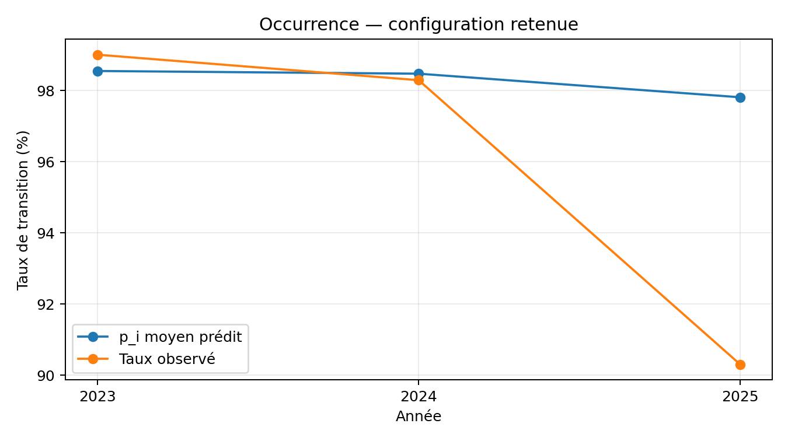
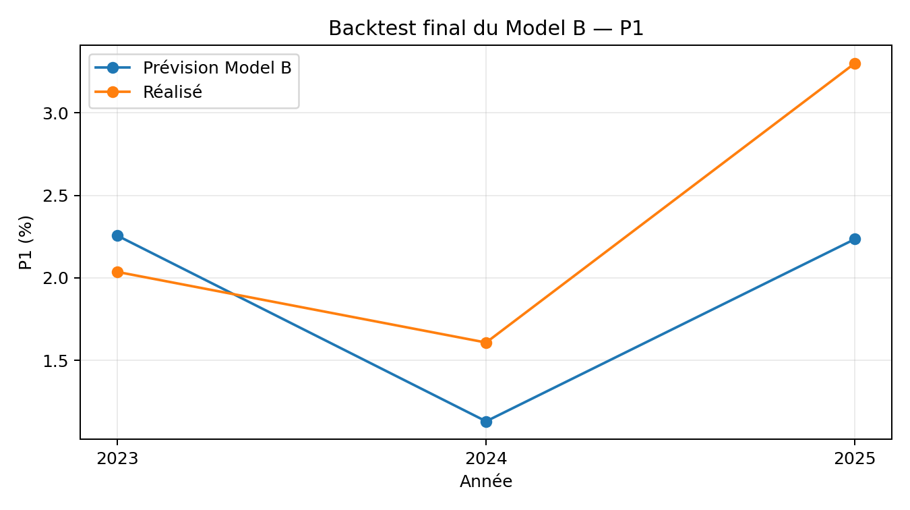
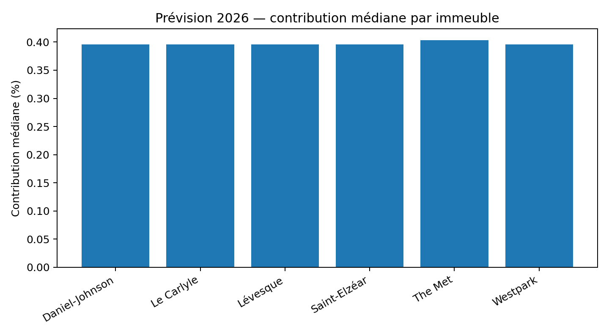

**MODÈLE B**

**Hierarchical Shrinkage Forecast**

JADCO / Collection Équinoxe — PolyAI / CodeML 2026

*Document méthodologique, résultats de validation et prévision 2026*

| **Élément**    | **Décision Model B**                                                             |
|----------------|----------------------------------------------------------------------------------|
| Architecture   | Deux étages : occurrence de transition + croissance conditionnelle               |
| Occurrence p_i | Taux empiriques hiérarchiques avec shrinkage / partial pooling                   |
| Croissance g_i | Médiane robuste de croissance conditionnelle ; baseline année précédente retenue |
| Agrégation     | P1 = médiane des contributions p_i × g_i                                         |
| Validation     | Walk-forward strict 2023 / 2024 / 2025                                           |
| Prévision 2026 | 0,397906 % sur 931 unités candidates                                             |
| Gouvernance    | Foundation Freeze intact ; développement isolé sur la branche model-b            |

Version finale — 4 octobre 2026

# Sommaire

1\. Résumé exécutif

2\. Position du Model B dans le système

3\. Fondation commune et contrat figé

4\. Définition mathématique

5\. Données et cohortes

6\. Architecture du Model B

7\. Sous-modèle d’occurrence p_i

8\. Tournoi occurrence 2023–2025

9\. Sous-modèle de croissance g_i

10\. Tournoi croissance 2023–2025

11\. Assemblage final P1

12\. Backtest final 2023–2025

13\. Prévision 2026

14\. Analyse externe 2026

15\. Anti-leakage, gouvernance et reproductibilité

16\. Difficultés rencontrées et solutions

17\. Limites et risques

18\. Handoff pour la comparaison Model A vs Model B

19\. Conclusion

Annexes

# 1. Résumé exécutif

Le Model B a été conçu comme une alternative statistique, hiérarchique
et volontairement plus simple que le Model A. Il conserve exactement la
même fondation : mêmes cohortes, mêmes cutoffs, même cible de
croissance, même définition business P1 et mêmes règles anti-leakage. La
différence se situe uniquement dans la manière d’estimer la probabilité
de transition p_i et la croissance conditionnelle g_i.

- Occurrence retenue : hiérarchie province → province + mois d’échéance,
  shrinkage λ = 20.

- Croissance retenue : médiane de la croissance conditionnelle de
  l’année précédente (baseline robuste G0).

- Agrégation : contribution_i = p_i × g_i, puis P1 = médiane des
  contributions.

- Backtest final P1_G0 : MAE 0,587807 pp, RMSE 0,686221 pp, biais
  -0,441200 pp, pire erreur annuelle 1,065971 pp.

- Prévision finale 2026 : 0,397906 % pour 931 unités candidates.

- Données externes : conservées en sensibilité qualitative uniquement,
  faute de disponibilité historique suffisante pour un backtest
  équitable.

Le Model B n’est pas présenté comme une croissance complète du rent
roll. Il s’agit d’un indice médian de contribution attendue des
transitions à la croissance annualisée du loyer effectif des unités à
échéance.

# 2. Position du Model B dans le système

Le Model B ne redéfinit pas le problème. Il intervient au-dessus de la
foundation commune déjà validée. Son objectif est de tester une
hypothèse suffisamment différente du Model A : plutôt qu’un pipeline ML
au niveau unité, B privilégie des statistiques de segments, des médianes
robustes et du partial pooling hiérarchique.

**Cohorte au cutoff → features admissibles → p_i → g_i → p_i × g_i →
médiane → P1**

- Model A : approche ML hybride au niveau unité.

- Model B : approche hiérarchique / segmentaire avec shrinkage.

- La comparaison A vs B est laissée au tournoi final de l’équipe ; ce
  document ne choisit pas entre A et B.

# 3. Fondation commune et contrat figé

| **Élément**       | **Contrat commun**                                                                  |
|-------------------|-------------------------------------------------------------------------------------|
| Clé same-unit     | sPropCode + sUnitCode ; ne jamais utiliser sSite + sUnitCode                        |
| Target principale | target_effective_annualized                                                         |
| Annualisation     | (R_new / R_old)^(365,25 / jours) - 1                                                |
| Cohorte           | Dernier bail connu au cutoff dont l’échéance contractuelle tombe dans l’année cible |
| Cutoffs           | 2022-12-31 → 2023 ; 2023-12-31 → 2024 ; 2024-12-31 → 2025 ; 2025-12-31 → 2026       |
| Business target   | P1 : médiane de p_i × E(G_i \| transition)                                          |
| Règle externe     | availability_verified=True et available_date ≤ prediction_origin                    |

La foundation avait également identifié 3 241 transitions same-unit
couvrant 892 unités, avec une couverture de 84,07 %. En 2025, la
croissance same-unit observée était d’environ 7,177 % en contractuel et
3,714 % en effectif, ce qui justifie l’usage du loyer effectif comme
mesure économique principale.

# 4. Définition mathématique

## 4.1 Croissance conditionnelle

**G_i = (R_effectif,nouveau / R_effectif,ancien)^(365,25 / Δjours) - 1**

G_i est la croissance annualisée du loyer effectif entre deux baux
consécutifs de la même unité. L’intervalle réel entre les dates de début
est utilisé ; sTermMonths n’est pas utilisé pour annualiser.

## 4.2 Occurrence de transition

**p_i = P(T_i = 1 \| informations connues au cutoff)**

Le label de transition n’est révélé qu’après la prédiction. La cohorte
candidate est constituée avec l’information disponible au cutoff.

## 4.3 Contribution et P1

**contribution_i = p_i × g_i**

**Forecast_B(Y) = 100 × médiane_i \[ p_i × g_i \]**

P1 est un indice événementiel. Il ne doit pas être présenté comme une
prévision du rent roll total.

# 5. Données et cohortes

| **Année test** | **Prediction origin** | **Candidats** | **Transitions observées** | **Taux observé** |
|----------------|-----------------------|---------------|---------------------------|------------------|
| 2023           | 2022-12-31            | 405           | 401                       | 99,012 %         |
| 2024           | 2023-12-31            | 645           | 634                       | 98,295 %         |
| 2025           | 2024-12-31            | 856           | 773                       | 90,304 %         |

La baisse du taux de transition en 2025 est un signal de dérive de
régime important. Elle a été traitée comme une source d’instabilité à
mesurer, et non comme une causalité attribuée à un immeuble particulier.

## 5.1 Cohorte 2026

| **Segment**    | **Unités** |
|----------------|------------|
| Québec         | 810        |
| Ontario        | 121        |
| Daniel-Johnson | 128        |
| Le Carlyle     | 180        |
| Lévesque       | 75         |
| Saint-Elzéar   | 268        |
| The Met        | 121        |
| Westpark       | 159        |

# 6. Architecture du Model B

Le Model B a été construit en deux composantes indépendantes puis
recombinées. Cette séparation permet d’utiliser une méthode adaptée à
chaque sous-problème : un estimateur de probabilités pour l’occurrence
et un estimateur robuste de croissance pour les transitions observées.

- B1 — Occurrence : taux empiriques hiérarchiques avec shrinkage vers un
  parent plus large.

- B2 — Growth : médianes de croissance par segment avec shrinkage
  robuste vers le parent.

- B3 — P1 : quatre combinaisons finalistes p_i × g_i évaluées sur
  2023–2025.

# 7. Sous-modèle d’occurrence p_i

L’objectif est d’estimer la probabilité qu’une unité candidate réalise
une transition pendant l’année cible. La méthode B évite la régression
logistique et utilise des taux historiques segmentaires avec partial
pooling.

**p_child = (n_child × taux_child + λ × p_parent) / (n_child + λ)**

Un petit segment est fortement ramené vers son parent ; un grand segment
conserve davantage son taux empirique. Les segments inconnus retombent
récursivement vers le parent puis le global.

| **Hiérarchies testées**                     | **Shrinkage λ**     |
|---------------------------------------------|---------------------|
| global                                      | 1, 2, 5, 10, 20, 50 |
| province                                    | 1, 2, 5, 10, 20, 50 |
| building                                    | 1, 2, 5, 10, 20, 50 |
| province → province+expiry_month            | 1, 2, 5, 10, 20, 50 |
| building → building+expiry_month            | 1, 2, 5, 10, 20, 50 |
| province → building                         | 1, 2, 5, 10, 20, 50 |
| province → building → building+expiry_month | 1, 2, 5, 10, 20, 50 |

# 8. Tournoi occurrence 2023–2025

Le tournoi réel a évalué 42 configurations Model B et la baseline
historical-global sur les trois années, soit 129 lignes de fold. Le
critère principal pour p_i était la qualité probabiliste (Brier,
calibration) avec vérification de la stabilité P1.

| **Configuration**             | **Mean Brier** | **Mean \|calibration gap\|** | **P1 MAE (pp)** | **Commentaire**                                         |
|-------------------------------|----------------|------------------------------|-----------------|---------------------------------------------------------|
| Historical global baseline    | 0,040124       | 0,029170                     | 0,917514        | Référence robuste                                       |
| Province + expiry_month, λ=20 | 0,038624       | 0,027175                     | 0,928185        | Meilleur mean Brier ; retenu pour p_i                   |
| Building, λ=5                 | 0,049341       | 0,003413                     | 0,915244        | Très bonne calibration moyenne, mais instable en 2025   |
| Building + expiry_month, λ=5  | 0,049151       | 0,002559                     | 0,944754        | Meilleure calibration moyenne, mais Brier/P1 moins bons |

En 2025, la baseline historique prédisait 98,19 % de transitions contre
90,30 % observé. Les variantes building à faible shrinkage ont parfois
corrigé la calibration moyenne, mais au prix de Brier beaucoup plus
élevés. La configuration province + expiry_month, λ=20 offrait le
meilleur compromis pour le sous-modèle d’occurrence.

# 9. Sous-modèle de croissance g_i

Pour la croissance conditionnelle, B a testé une approche robuste basée
sur la médiane, afin de limiter l’influence des valeurs extrêmes de
croissance annualisée.

**w = n / (n + λ)**

**g_child = w × médiane(g_child) + (1 - w) × g_parent**

Les hiérarchies testées incluaient global, province, building, bedrooms,
province → building, building → bedrooms et province → building →
bedrooms, avec les mêmes forces de shrinkage 1, 2, 5, 10, 20 et 50.

# 10. Tournoi croissance 2023–2025

Le tournoi croissance a évalué 44 configurations. Après correction du
scope de scoring pour comparer Model B et les baselines sur les mêmes
transitions candidates, les meilleurs résultats observés étaient les
suivants :

| **Critère**                       | **Meilleur résultat**             | **Valeur**  |
|-----------------------------------|-----------------------------------|-------------|
| Mean MAE                          | Baseline médiane année précédente | 4,250699 pp |
| Mean RMSE                         | Province, λ=1                     | 5,669891 pp |
| Portfolio MAE                     | Baseline médiane année précédente | 0,727596 pp |
| Pire erreur annuelle portefeuille | Baseline médiane année précédente | 1,434467 pp |

Conclusion : le growth hiérarchique G1 pouvait améliorer certains
critères ou certaines années, mais la médiane de l’année précédente
était plus robuste au niveau portefeuille. En particulier, les variantes
G1 sous-prédisaient en 2025 après avoir sur-prédit 2023–2024. La
baseline G0 a donc été conservée pour l’assemblage final.

# 11. Assemblage final P1

Quatre combinaisons finalistes ont été évaluées sans retuning
supplémentaire :

| **Code** | **Occurrence**                         | **Growth**                        |
|----------|----------------------------------------|-----------------------------------|
| P0_G0    | Historical global baseline             | Médiane année précédente          |
| P0_G1    | Historical global baseline             | Growth hiérarchique province, λ=1 |
| P1_G0    | Province → province+expiry_month, λ=20 | Médiane année précédente          |
| P1_G1    | Province → province+expiry_month, λ=20 | Growth hiérarchique province, λ=1 |

| **Model** | **P1 MAE** | **P1 RMSE** | **Biais** | **Pire erreur annuelle** |
|-----------|------------|-------------|-----------|--------------------------|
| P0_G0     | 0,594273   | 0,704724    | -0,467536 | 1,100824                 |
| P0_G1     | 0,935591   | 1,054054    | +0,654033 | 1,587158                 |
| P1_G0     | 0,587807   | 0,686221    | -0,441200 | 1,065971                 |
| P1_G1     | 0,946731   | 1,078687    | +0,695575 | 1,628247                 |

P1_G0 termine premier sur les quatre métriques de synthèse. Cette
combinaison est donc figée comme Model B final avant de regarder le
résultat 2026.

# 12. Backtest final 2023–2025

| **Année** | **Prévision P1** | **Réalisé P1** | **Erreur**   |
|-----------|------------------|----------------|--------------|
| 2023      | 2.256013 %       | 2.036102 %     | +0.219911 pp |
| 2024      | 1.130315 %       | 1.607852 %     | -0.477538 pp |
| 2025      | 2.234907 %       | 3.300878 %     | -1.065971 pp |

Lecture : le modèle est légèrement trop élevé en 2023, trop bas en 2024
et surtout en 2025. L’erreur 2025 reflète un changement de régime
difficile à anticiper à partir des informations disponibles au cutoff.

# 13. Prévision 2026

Une fois P1_G0 figé, le pipeline a été appliqué au cutoff du 31 décembre
2025 sans retuning et sans lecture d’outcomes 2026.

| **Mesure**                     | **Résultat** |
|--------------------------------|--------------|
| Candidats 2026                 | 931          |
| p_i moyen                      | 0,950387     |
| p_i médian                     | 0,968385     |
| g_i — médiane année précédente | 0,410897 %   |
| Forecast Model B P1            | 0,397906 %   |

Le forecast faible provient principalement du g_i 2026 : seules 7
transitions 2025 éligibles au cutoff alimentaient la baseline année
précédente, dont la médiane était 0,410897 %. Le facteur occurrence
reste élevé, avec une médiane p_i de 96,84 %.

## 13.1 Diagnostics par province

| **Province** | **Candidats** | **Mean p_i** | **P1 segment** |
|--------------|---------------|--------------|----------------|
| Ontario      | 121           | 0,976217     | 0,4034 %       |
| Québec       | 810           | 0,946529     | 0,3960 %       |

## 13.2 Diagnostics par immeuble

| **Immeuble**   | **Candidats** | **Mean p_i** | **P1 segment** |
|----------------|---------------|--------------|----------------|
| Daniel-Johnson | 128           | 0.943643     | 0.3960 %       |
| Le Carlyle     | 180           | 0.941457     | 0.3960 %       |
| Lévesque       | 75            | 0.935871     | 0.3960 %       |
| Saint-Elzéar   | 268           | 0.950460     | 0.3960 %       |
| The Met        | 121           | 0.976217     | 0.4034 %       |
| Westpark       | 159           | 0.952996     | 0.3960 %       |

## 13.3 Diagnostics par mois d’échéance

| **Mois** | **Candidats** | **Mean p_i** | **P1 segment** |
|----------|---------------|--------------|----------------|
| 1        | 38            | 0.951523     | 0.3904 %       |
| 2        | 52            | 0.972072     | 0.3988 %       |
| 3        | 65            | 0.978535     | 0.4018 %       |
| 4        | 62            | 0.981757     | 0.4034 %       |
| 5        | 91            | 0.974068     | 0.3998 %       |
| 6        | 143           | 0.965990     | 0.3956 %       |
| 7        | 90            | 0.981625     | 0.4031 %       |
| 8        | 91            | 0.957335     | 0.3923 %       |
| 9        | 108           | 0.966407     | 0.3960 %       |
| 10       | 61            | 0.969569     | 0.3979 %       |
| 11       | 69            | 0.867457     | 0.3500 %       |
| 12       | 61            | 0.787222     | 0.3172 %       |

Les mois de novembre et décembre présentent des probabilités de
transition plus faibles, avec des contributions médianes d’environ
0,3500 % et 0,3172 %. Tous les 931 candidats ont reçu une estimation
province + mois ; aucun fallback vers province seule ou global n’a été
nécessaire.

# 14. Analyse externe 2026

L’analyse externe a été menée séparément afin de ne pas contaminer le
modèle principal. Sur 113 lignes externes, 12 étaient marquées comme
vérifiées et 9 étaient effectivement admissibles au 31 décembre 2025.
Elles appartenaient toutes à la famille TAL legacy rent-fixing
components pour le Québec.

| **Signal TAL**                   | **Valeur** | **Référence**           | **Disponible** |
|----------------------------------|------------|-------------------------|----------------|
| tal_legacy_building_services     | 4.5 %      | 2025-04-02 / 2026-04-01 | 2025-01-21     |
| tal_legacy_capital_expenditure   | 4.7 %      | 2025-04-02 / 2026-04-01 | 2025-01-21     |
| tal_legacy_electricity           | 2.9 %      | 2025-04-02 / 2026-04-01 | 2025-01-21     |
| tal_legacy_fuel_oil_other_energy | -2.9 %     | 2025-04-02 / 2026-04-01 | 2025-01-21     |
| tal_legacy_gas                   | -5.8 %     | 2025-04-02 / 2026-04-01 | 2025-01-21     |
| tal_legacy_maintenance           | 6.9 %      | 2025-04-02 / 2026-04-01 | 2025-01-21     |
| tal_legacy_management            | 8.2 %      | 2025-04-02 / 2026-04-01 | 2025-01-21     |
| tal_legacy_net_income            | 6.9 %      | 2025-04-02 / 2026-04-01 | 2025-01-21     |
| tal_legacy_personal_services_rpa | 5.9 %      | 2025-04-02 / 2026-04-01 | 2025-01-21     |

Ces composantes sont mixtes et ne constituent pas un taux global de
croissance des loyers. Elles ne sont pas directement comparables à la
target same-unit effective-rent growth. De plus, aucune ligne externe
vérifiée n’était admissible aux origins 2022-12-31, 2023-12-31 ou
2024-12-31. Elles ne pouvaient donc pas être intégrées proprement au
tournoi historique 2023–2025.

- Downside : pression externe plus faible que ce que suggèrent certains
  postes de coûts.

- Base : forecast officiel inchangé à 0,397906 %.

- Upside : certaines composantes positives pourraient soutenir des
  hausses supérieures, sans qu’un mapping quantitatif fiable vers la
  target soit démontré.

# 15. Anti-leakage, gouvernance et reproductibilité

- Prediction origins figés pour chaque année.

- Cohorte construite avant révélation des transitions de l’année cible.

- Aucun nouveau loyer, nouvelle concession, nouveau bail, sRenewal futur
  ou outcome futur dans les features.

- Les données externes doivent satisfaire availability_verified=True et
  available_date ≤ prediction_origin.

- Le forecast 2026 a été produit après sélection de P1_G0, sans retuning
  sur le résultat 2026.

- Les fichiers CRM privés sont restés locaux et ignorés par Git.

- Le développement a été isolé sur la branche model-b ; aucun push n’a
  été fait sur main.

Vérification Git avant push : git diff --name-only main...HEAD ne
montrait que les neuf fichiers nouveaux sous src/models/model_b/ et
tests/model_b/. Aucun fichier de foundation, notebook, requirement,
.gitignore ou dataset de départ n’a été modifié.

| **Fichiers ajoutés Model B**       |
|------------------------------------|
| src/models/model_b/\_\_init\_\_.py |
| src/models/model_b/occurrence.py   |
| src/models/model_b/growth.py       |
| src/models/model_b/model.py        |
| src/models/model_b/experiments.py  |
| tests/model_b/test_occurrence.py   |
| tests/model_b/test_growth.py       |
| tests/model_b/test_model.py        |
| tests/model_b/test_experiments.py  |

Validation finale : 53 tests Model B passés, plus 35 sous-tests. Le push
a été effectué sur origin/model-b uniquement.

# 16. Difficultés rencontrées et solutions

| **Difficulté**                  | **Impact**                                                                                                                                   | **Solution**                                                                                                                                          |
|---------------------------------|----------------------------------------------------------------------------------------------------------------------------------------------|-------------------------------------------------------------------------------------------------------------------------------------------------------|
| Compatibilité Python            | Python 3.14 ne pouvait pas installer correctement la stack pinée (notamment contourpy==1.3.0, absence de wheel et tentative de compilation). | Installation de Python 3.12, création d’un .venv dédié et réinstallation des requirements.                                                            |
| Test .gitignore sous Windows    | 46/47 tests passaient ; un test git check-ignore échouait à cause des fins de ligne CRLF et de chemins lus avec \r.                          | Vérification manuelle de git check-ignore : external_signals.csv non ignoré, data/raw et data/processed bien ignorés. Aucun changement de foundation. |
| Données CRM absentes du repo    | Le tournoi réel ne pouvait pas s’exécuter car les CSV privés n’étaient volontairement pas présents dans Git.                                 | Copie locale vers data/raw/ depuis le dossier de travail précédent ; .gitignore confirmé avant toute exécution.                                       |
| Transcription de résultats      | Une première sortie Copilot avait des cellules 2024/2025 décalées dans le CSV texte.                                                         | Rerun complet et impression directe des DataFrames pandas avec validations de shape, types et duplicats.                                              |
| Comparaison baseline vs Model B | Le premier tournoi g_i scorait les baselines sur un scope différent de Model B.                                                              | Réutilisation des fonctions de baseline de la foundation, mais scoring sur les mêmes transitions candidates cutoff-matched.                           |
| Cas de test baseline 2023       | Dans un fixture synthétique, aucune étiquette 2022 mature n’était disponible pour la baseline previous-year.                                 | Production laissée stricte ; valeur explicite uniquement dans le fixture de test.                                                                     |
| Découverte de tests             | Pylance signalait parfois “No tests found” ou pytest avait besoin du bon PYTHONPATH.                                                         | Exécution explicite de pytest avec l’interpréteur du .venv et PYTHONPATH du workspace.                                                                |
| Dérive 2025                     | Le taux de transition chute à 90,304 % et plusieurs modèles segmentaires deviennent instables.                                               | Usage du shrinkage, analyse séparée par métrique et refus de choisir un modèle sur une seule année.                                                   |
| Données externes limitées       | Aucun signal externe admissible aux cutoffs historiques 2022–2024.                                                                           | Données externes conservées en sensibilité qualitative ; aucune intégration forcée au modèle principal.                                               |

# 17. Limites et risques

- Seulement trois années de backtest complet : le classement des modèles
  reste statistiquement fragile.

- La chute d’occurrence 2025 suggère un concept drift difficile à
  apprendre avec l’historique disponible.

- Le forecast 2026 dépend d’un g_i previous-year calculé sur seulement 7
  transitions 2025 éligibles au cutoff, ce qui augmente l’incertitude.

- P1 est un indice de contribution attendue des transitions, pas un
  rent-roll forecast complet.

- La disponibilité historique des données externes est insuffisante pour
  en mesurer la valeur prédictive.

- Le modèle hiérarchique peut être trop conservateur face à un
  changement structurel rapide, mais son shrinkage protège contre le
  surapprentissage des petits segments.

# 18. Handoff pour la comparaison Model A vs Model B

Le Model B est livré comme un candidat autonome et reproductible. La
comparaison finale avec Model A doit être effectuée par l’équipe à
l’aide des mêmes années, du même P1 et des mêmes métriques. Ce document
ne déclare pas B meilleur ou moins bon que A.

| **À transmettre au tournoi A vs B** | **Valeur / état**                                                             |
|-------------------------------------|-------------------------------------------------------------------------------|
| Configuration finale B              | p_i = province → province+expiry_month, λ=20 ; g_i = médiane année précédente |
| Backtest 2023                       | 2,256013 % vs 2,036102 % ; erreur +0,219911 pp                                |
| Backtest 2024                       | 1,130315 % vs 1,607852 % ; erreur -0,477538 pp                                |
| Backtest 2025                       | 2,234907 % vs 3,300878 % ; erreur -1,065971 pp                                |
| P1 MAE                              | 0,587807 pp                                                                   |
| P1 RMSE                             | 0,686221 pp                                                                   |
| P1 biais                            | -0,441200 pp                                                                  |
| Pire erreur                         | 1,065971 pp                                                                   |
| Forecast 2026                       | 0,397906 %                                                                    |

# 19. Conclusion

Model B — Hierarchical Shrinkage Forecast est un système prédictif à
deux étages, anti-leakage et volontairement parcimonieux. Son intérêt
principal réside dans sa robustesse : il utilise le partial pooling pour
l’occurrence et conserve une baseline médiane simple pour la croissance
lorsque les backtests montrent qu’une complexité supplémentaire
n’améliore pas la stabilité portefeuille.

Le pipeline final a été choisi uniquement à partir des backtests
2023–2025, puis figé avant l’application 2026. La prévision obtenue est
0,397906 % sur 931 unités candidates. Les signaux externes ont été
examinés séparément et n’ont pas modifié cette estimation. Le code a été
isolé dans la branche model-b, testé et poussé sans modification des
fichiers de départ ni de la foundation commune.

# Annexe A — Tableau complet des 42 configurations Model B — occurrence

| **Hiérarchie**                 | **λ** | **Mean Brier** | **Mean \|cal gap\|** | **P1 MAE** | **P1 RMSE** | **P1 biais** | **Worst P1** |
|--------------------------------|-------|----------------|----------------------|------------|-------------|--------------|--------------|
| global                         | 1     | 0.040124       | 0.029170             | 0.917514   | 1.124312    | 0.795817     | 1.762736     |
| global                         | 2     | 0.040124       | 0.029170             | 0.917514   | 1.124312    | 0.795817     | 1.762736     |
| global                         | 5     | 0.040124       | 0.029170             | 0.917514   | 1.124312    | 0.795817     | 1.762736     |
| global                         | 10    | 0.040124       | 0.029170             | 0.917514   | 1.124312    | 0.795817     | 1.762736     |
| global                         | 20    | 0.040124       | 0.029170             | 0.917514   | 1.124312    | 0.795817     | 1.762736     |
| global                         | 50    | 0.040124       | 0.029170             | 0.917514   | 1.124312    | 0.795817     | 1.762736     |
| province                       | 1     | 0.040124       | 0.029170             | 0.917514   | 1.124312    | 0.795817     | 1.762736     |
| province                       | 2     | 0.040124       | 0.029170             | 0.917514   | 1.124312    | 0.795817     | 1.762736     |
| province                       | 5     | 0.040124       | 0.029170             | 0.917514   | 1.124312    | 0.795817     | 1.762736     |
| province                       | 10    | 0.040124       | 0.029170             | 0.917514   | 1.124312    | 0.795817     | 1.762736     |
| province                       | 20    | 0.040124       | 0.029170             | 0.917514   | 1.124312    | 0.795817     | 1.762736     |
| province                       | 50    | 0.040124       | 0.029170             | 0.917514   | 1.124312    | 0.795817     | 1.762736     |
| building                       | 1     | 0.077638       | 0.027600             | 0.915229   | 1.122677    | 0.793532     | 1.762736     |
| building                       | 2     | 0.064039       | 0.017283             | 0.915232   | 1.122679    | 0.793536     | 1.762736     |
| building                       | 5     | 0.049341       | 0.003413             | 0.915244   | 1.122688    | 0.793547     | 1.762736     |
| building                       | 10    | 0.043519       | 0.013355             | 0.915264   | 1.122702    | 0.793567     | 1.762736     |
| building                       | 20    | 0.041127       | 0.020284             | 0.915301   | 1.122729    | 0.793605     | 1.762736     |
| building                       | 50    | 0.040237       | 0.025409             | 0.915407   | 1.122804    | 0.793711     | 1.762736     |
| province_expiry_month          | 1     | 0.038794       | 0.026489             | 0.931629   | 1.160285    | 0.847953     | 1.814402     |
| province_expiry_month          | 2     | 0.038771       | 0.026528             | 0.931401   | 1.159878    | 0.847418     | 1.813886     |
| province_expiry_month          | 5     | 0.038716       | 0.026645             | 0.930754   | 1.158712    | 0.845880     | 1.812396     |
| province_expiry_month          | 10    | 0.038658       | 0.026833             | 0.929786   | 1.156929    | 0.843518     | 1.810097     |
| province_expiry_month          | 20    | 0.038624       | 0.027175             | 0.928185   | 1.153869    | 0.839422     | 1.806083     |
| province_expiry_month          | 50    | 0.038742       | 0.027912             | 0.925058   | 1.147383    | 0.830551     | 1.797297     |
| building_expiry_month          | 1     | 0.078256       | 0.028869             | 0.949480   | 1.161230    | 0.827784     | 1.811771     |
| building_expiry_month          | 2     | 0.064463       | 0.018267             | 0.948104   | 1.159464    | 0.826408     | 1.809027     |
| building_expiry_month          | 5     | 0.049151       | 0.002559             | 0.944754   | 1.155231    | 0.823058     | 1.802592     |
| building_expiry_month          | 10    | 0.042932       | 0.012020             | 0.940831   | 1.150401    | 0.819135     | 1.795516     |
| building_expiry_month          | 20    | 0.040414       | 0.019566             | 0.935812   | 1.144539    | 0.814115     | 1.787607     |
| building_expiry_month          | 50    | 0.039670       | 0.025197             | 0.929189   | 1.137129    | 0.807492     | 1.778324     |
| province_building              | 1     | 0.077638       | 0.027600             | 0.915229   | 1.122677    | 0.793532     | 1.762736     |
| province_building              | 2     | 0.064039       | 0.017283             | 0.915232   | 1.122679    | 0.793536     | 1.762736     |
| province_building              | 5     | 0.049341       | 0.003413             | 0.915244   | 1.122688    | 0.793547     | 1.762736     |
| province_building              | 10    | 0.043519       | 0.013355             | 0.915264   | 1.122702    | 0.793567     | 1.762736     |
| province_building              | 20    | 0.041127       | 0.020284             | 0.915301   | 1.122729    | 0.793605     | 1.762736     |
| province_building              | 50    | 0.040237       | 0.025409             | 0.915407   | 1.122804    | 0.793711     | 1.762736     |
| province_building_expiry_month | 1     | 0.078256       | 0.028869             | 0.949480   | 1.161230    | 0.827784     | 1.811771     |
| province_building_expiry_month | 2     | 0.064463       | 0.018267             | 0.948104   | 1.159464    | 0.826408     | 1.809027     |
| province_building_expiry_month | 5     | 0.049151       | 0.002559             | 0.944754   | 1.155231    | 0.823058     | 1.802592     |
| province_building_expiry_month | 10    | 0.042932       | 0.012020             | 0.940831   | 1.150401    | 0.819135     | 1.795516     |
| province_building_expiry_month | 20    | 0.040414       | 0.019566             | 0.935812   | 1.144539    | 0.814115     | 1.787607     |
| province_building_expiry_month | 50    | 0.039670       | 0.025197             | 0.929189   | 1.137129    | 0.807492     | 1.778324     |

# Annexe B — Résultats complets des quatre combinaisons finales

| **Année** | **Model** | **N** | **P1 prédit %** | **P1 réalisé %** | **Erreur pp** | **p prédit** | **p observé** | **g prédit %** | **g observé %** |
|-----------|-----------|-------|-----------------|------------------|---------------|--------------|---------------|----------------|-----------------|
| 2023      | P0_G0     | 405   | 2.226208        | 2.036102         | +0.190105     | 0.983278     | 0.990123      | 2.264068       | 2.085372        |
| 2023      | P0_G1     | 405   | 2.833380        | 2.036102         | +0.797278     | 0.983278     | 0.990123      | 2.881567       | 2.085372        |
| 2023      | P1_G0     | 405   | 2.256013        | 2.036102         | +0.219911     | 0.985538     | 0.990123      | 2.264068       | 2.085372        |
| 2023      | P1_G1     | 405   | 2.871314        | 2.036102         | +0.835212     | 0.985538     | 0.990123      | 2.881567       | 2.085372        |
| 2024      | P0_G0     | 645   | 1.115963        | 1.607852         | -0.491889     | 0.984751     | 0.982946      | 1.133244       | 1.699619        |
| 2024      | P0_G1     | 645   | 3.195010        | 1.607852         | +1.587158     | 0.984751     | 0.982946      | 3.244485       | 1.699619        |
| 2024      | P1_G0     | 645   | 1.130315        | 1.607852         | -0.477538     | 0.984776     | 0.982946      | 1.133244       | 1.699619        |
| 2024      | P1_G1     | 645   | 3.236099        | 1.607852         | +1.628247     | 0.984776     | 0.982946      | 3.244485       | 1.699619        |
| 2025      | P0_G0     | 856   | 2.200054        | 3.300878         | -1.100824     | 0.981895     | 0.903037      | 2.240621       | 3.716980        |
| 2025      | P0_G1     | 856   | 2.878542        | 3.300878         | -0.422336     | 0.981895     | 0.903037      | 2.931619       | 3.716980        |
| 2025      | P1_G0     | 856   | 2.234907        | 3.300878         | -1.065971     | 0.978146     | 0.903037      | 2.240621       | 3.716980        |
| 2025      | P1_G1     | 856   | 2.924144        | 3.300878         | -0.376735     | 0.978146     | 0.903037      | 2.931619       | 3.716980        |
